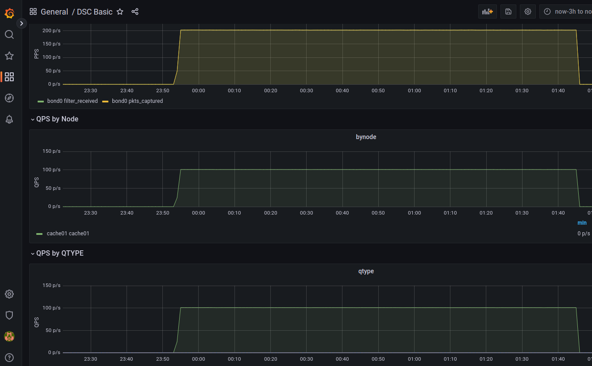

# 1. DSC collector setup

- [1. DSC collector setup](#1-dsc-collector-setup)
- [2. Description](#2-description)
- [3. Reference](#3-reference)
- [4. Environment](#4-environment)
- [5. install DSC collector on Cache DNS](#5-install-dsc-collector-on-cache-dns)
  - [5.1. config](#51-config)
- [6. setup grafana, influxdb](#6-setup-grafana-influxdb)
  - [6.1. launch grafana and influxdb with docker compose](#61-launch-grafana-and-influxdb-with-docker-compose)
  - [6.2. influxdb database](#62-influxdb-database)
  - [6.3. install plugin(grafana)](#63-install-plugingrafana)
  - [6.4. configure a data source(grafana)](#64-configure-a-data-sourcegrafana)
  - [6.5. setup dashboards(grafana)](#65-setup-dashboardsgrafana)
  - [6.6. import xml files generated by dsc collector](#66-import-xml-files-generated-by-dsc-collector)
- [7. Start dsc collector when booting OS](#7-start-dsc-collector-when-booting-os)

# 2. Description

Here are logs when setting up DCS colletor and Grafana/InfluxDB on RockyLinux 8.6.

# 3. Reference

- http://dns.measurement-factory.com/tools/dsc/download/dsc-manual.pdf
- https://github.com/DNS-OARC/dsc
- https://github.com/DNS-OARC/dsc-datatool/wiki/Setting-up-a-test-Grafana

# 4. Environment

There are two nodes.
- Cache DNS * 1
- Grafana/influxdb * 1

Set up Grafana/Influxdb with docker compose.

- DSC collector
  - Rocky Linux 8.6
- DSC presenter
  - Rocky Linux 8.6

# 5. install DSC collector on Cache DNS

```text
# cat /etc/rocky-release
Rocky Linux release 8.6 (Green Obsidian)
```

Use this repo
https://copr.fedorainfracloud.org/coprs/g/dnsoarc/dsc/

download repo
```text
# curl -o /etc/yum.repos.d/group_dnsoarc-dsc-epel-8.repo https://copr.fedorainfracloud.org/coprs/g/dnsoarc/dsc/repo/epel-8/group_dnsoarc-dsc-epel-8.repo
```

To solve dependencies, you also need to install epel-release.
```text
# dnf install -y epel-release
```

```text
# dnf search dsc | grep ^dsc
Last metadata expiration check: 0:07:21 ago on Fri 11 Nov 2022 01:20:46 AM JST.
dsc.x86_64 : DNS Statistics Collector
dsc.src : DNS Statistics Collector
dsc-datatool.noarch : Export DSC data to other formats and/or databases
dsc-datatool.src : Export DSC data to other formats and/or databases
dsc-datatool-doc.noarch : Documentation files for dsc-datatool
dsc-debuginfo.x86_64 : Debug information for package dsc
dsc-debugsource.x86_64 : Debug sources for package dsc
```

install dsc.
```text
# dnf install -y dsc
```

## 5.1. config

```text
# rpm -ql dsc | grep -E 'etc|bin'
/etc/dsc
/etc/dsc/dsc.conf.sample
/usr/bin/dsc
/usr/bin/dsc-psl-convert
```

```text
# cp /etc/dsc/dsc.conf.sample /etc/dsc/dsc.conf
```

```text
# grep ^run_dir /etc/dsc/dsc.conf
run_dir "/var/lib/dsc";
# mkdir /var/lib/dsc
```

test run with foreground and debug.
```text
# dsc -d -f -D /etc/dsc/dsc.conf
adding local address 127.0.0.1
adding local address ::1
adding local address 192.168.221.10
setting current directory to /var/lib/dsc
minfree_bytes 5000000
PID file is: /run/dsc.pid
Opening interface bond0
creating dataset qtype
creating dataset rcode
creating dataset opcode
creating dataset rcode_vs_replylen
creating dataset client_subnet
creating dataset qtype_vs_qnamelen
creating dataset qtype_vs_tld
creating dataset certain_qnames_vs_qtype
creating dataset client_subnet2
creating dataset client_addr_vs_rcode
creating dataset chaos_types_and_names
creating dataset idn_qname
creating dataset edns_version
creating dataset edns_bufsiz
creating dataset do_bit
creating dataset rd_bit
creating dataset idn_vs_tld
creating dataset ipv6_rsn_abusers
creating dataset transport_vs_qtype
creating dataset client_port_range
creating dataset direction_vs_ipproto
Setting statistics interval to: 60
country_index: No database loaded for GeoIP
asn_index: No database loaded for GeoIP ASN
writing PID to /run/dsc.pid
Running
```

```text
# ps aux | grep $(pidof dsc) | grep -v grep
root       24393  0.0  0.3  41572  7084 pts/0    S+   01:42   0:00 dsc -d -f -D /etc/dsc/dsc.conf
```

```text
asn_index: No database loaded for GeoIP ASN
writing PID to /run/dsc.pid
Running
inter-run processing delay: 0 ms
writing to 1668098580.dscdata.xml.XXXsmkFQh
renaming to 1668098580.dscdata.xml
inter-run processing delay: 0 ms
writing to 1668098640.dscdata.xml.XXXbHI1co
renaming to 1668098640.dscdata.xml
```

```text
# ls /var/lib/dsc/
1668098580.dscdata.xml  1668098640.dscdata.xml
```

run dsc as background daemon.
`-T` : disable using Threads
```text
# dsc /etc/dsc/dsc.conf -T
```

```text
# ps aux |grep $(pidof dsc)|grep -v grep
root       24784  0.0  0.2  41500  5412 ?        Ss   01:53   0:00 dsc /etc/dsc/dsc.conf -T
```

# 6. setup grafana, influxdb

## 6.1. launch grafana and influxdb with docker compose

install docker and docker-composes on rocky linux 8.
- https://www.digitalocean.com/community/tutorials/how-to-install-and-use-docker-on-rocky-linux-8
- https://www.digitalocean.com/community/tutorials/how-to-install-and-use-docker-compose-on-rocky-linux-8

set up grafana with docker-compose by following the instruction as below.
- https://github.com/DNS-OARC/dsc-datatool/wiki/Setting-up-a-test-Grafana-in-Docker


```text
# mkdir -p /vol/dns/monitor/volumes/{grafana-data,influxdb-data}
# chmod 777 -R /vol
# chmod 777 -R /vol/*
```

`docker-compose.yml`
```yml
services:
  grafana:
    image: grafana/grafana
    container_name: grafana
    restart: always
    ports:
      - 3000:3000
    networks:
      - monitoring
    volumes:
      - /vol/dns/monitor/volumes/grafana-data:/var/lib/grafana
  influxdb:
    image: influxdb
    container_name: influxdb
    restart: always
    ports:
      - 8086:8086
    networks:
      - monitoring
    volumes:
      - /vol/dns/monitor/volumes/influxdb-data:/var/lib/influxdb
networks:
  monitoring:
```

```text
# docker compose pull
# docker compose up -d
```

```text
# docker compose ps
NAME                COMMAND                  SERVICE             STATUS              PORTS
grafana             "/run.sh"                grafana             running             0.0.0.0:3000->3000/tcp, :::3000->3000/tcp
influxdb            "/entrypoint.sh infl…"   influxdb            running             0.0.0.0:8086->8086/tcp, :::8086->8086/tcp
```

## 6.2. influxdb database 

- https://github.com/DNS-OARC/dsc-datatool/wiki/Setting-up-a-test-Grafana#influxdb-setup

```text
# docker exec -it influxdb bash
root@60e5ed6dbc9e:/# influx setup -u dsc -p password -o dsc -b dsc -f
User    Organization    Bucket
dsc     dsc             dsc

root@60e5ed6dbc9e:/# influx v1 dbrp create --db dsc --rp autogen --bucket-id `influx bucket list -n dsc --hide-headers|cut -f 1`
ID                      Database        Bucket ID               Retention Policy        Default Organization ID
0a486480e5421000        dsc             1463e9ade392379c        autogen                 true    3828951e5d636bb1

root@60e5ed6dbc9e:/# influx auth create --org dsc --read-bucket `influx bucket list -n dsc --hide-headers|cut -f 1`
ID                      Description     Token                                                                                           User Name       User ID                 Permissions
0a48648e1cc21000                        kIv9TAdntTnXrUWaqM4j_UmvQvi001tf5IR7vMvTYBvg9AW8N97sFH5OhaT469MN4xw0DBwvyF29yKysEZasfg==        dsc             0a486471d2421000        [read:orgs/3828951e5d636bb1/buckets/1463e9ade392379c]
root@60e5ed6dbc9e:/#
```

My token is `kIv9TAdn...`

## 6.3. install plugin(grafana)

```text
# docker exec -it grafana bash
bash-5.1$ grafana-cli plugins install grafana-piechart-panel
✔ Downloaded and extracted grafana-piechart-panel v1.6.4 zip successfully to /var/lib/grafana/plugins/grafana-piechart-panel

Please restart Grafana after installing plugins. Refer to Grafana documentation for instructions if necessary.

bash-5.1$ exit
exit
```

```text
# docker compose restart
```

## 6.4. configure a data source(grafana)

add a data source 

- https://github.com/DNS-OARC/dsc-datatool/wiki/Setting-up-a-test-Grafana#grafana-data-source

## 6.5. setup dashboards(grafana)

import three json files.
- https://github.com/DNS-OARC/dsc-datatool/wiki/Setting-up-a-test-Grafana#example-grafana-dashboards


## 6.6. import xml files generated by dsc collector

Do the followings on the Grafana node.

- https://github.com/DNS-OARC/dsc-datatool/wiki/Setting-up-a-test-Grafana#import

```text
# dnf install dsc-datatool -y

# wget https://github.com/DNS-OARC/dsc-datatool/raw/develop/contrib/iana-dns-params-toyaml.py

# python3 iana-dns-params-toyaml.py > $HOME/labler.yaml

# file ~/labler.yaml 
/root/labler.yaml: ASCII text
```

copy xml files generated on Cache DNS node to the Grafana.
You will find xml files under /var/lib/dcs directory on Cache DNS.

copied xml files to the Grafana node.
```text
# ls dsc_xml/
1668351300.dscdata.xml  1668352440.dscdata.xml  1668353580.dscdata.xml  1668354720.dscdata.xml  1668355860.dscdata.xml  1668357000.dscdata.xml
1668351360.dscdata.xml  1668352500.dscdata.xml  1668353640.dscdata.xml  1668354780.dscdata.xml  1668355920.dscdata.xml  1668357060.dscdata.xml
<snip>
```

generate a data
```text
# SERVER=cache01
# NODE=cache01
# XML=/root/dsc_xml
# echo ${SERVER},${NODE},${XML}
cache01,cache01,/root/dsc_xml
```

```text
# dsc-datatool \
  --server "$SERVER" \
  --node "$NODE" \
  --output ";InfluxDB;dml=1;database=dsc" \
  --transform ";Labler;*;yaml=$HOME/labler.yaml" \
  --transform ";ReRanger;rcode_vs_replylen;range=/64;pad_to=5" \
  --transform ";ReRanger;qtype_vs_qnamelen;range=/16;pad_to=3" \
  --transform ";ReRanger;client_port_range;key=low;range=/2048;pad_to=5" \
  --transform ";ReRanger;edns_bufsiz,priming_queries;key=low;range=/512;pad_to=5;allow_invalid_keys=1" \
  --transform ";ReRanger;priming_responses;key=low;range=/128;pad_to=4" \
  --transform ";NetRemap;client_subnet,client_subnet2,client_addr_vs_rcode,ipv6_rsn_abusers;net=8" \
  --generator client_subnet_country \
  --generator ";client_subnet_authority;fetch=yes" \
  --xml "$XML" > ${SERVER}_dsc_influxdb
```

```text
# file cache01_dsc_influxdb 
cache01_dsc_influxdb: ASCII text
```

import data.
```text
# docker cp cache01_dsc_influxdb influxdb:/root/

# docker exec -it influxdb bash
root@60e5ed6dbc9e:/# 
root@60e5ed6dbc9e:~# influx write -b dsc -o dsc --format=lp --file /root/cache01_dsc_influxdb
```

Go to the Grafana dashboard, you will see DNS statistics on the dashboards as below.



# 7. Start dsc collector when booting OS

Reference
- https://github.com/DNS-OARC/dsc/issues/149
- https://access.redhat.com/solutions/3552831

dns_stats_collector.service
```text
[Unit]
Description=DNS Stats Collector
After=local-fs.target
After=syslog.target
After=network.target

[Service]
Type=forking
ExecStart=/usr/bin/dsc /etc/dsc/dsc.conf -T

[Install]
WantedBy=multi-user.target
```

```text
# cp dns_stats_collector.service /usr/lib/systemd/system/

# systemctl daemon-reload 

# systemctl list-unit-files --type service |grep dns_stats
dns_stats_collector.service                disabled

# systemctl enable dns_stats_collector.service 
```
