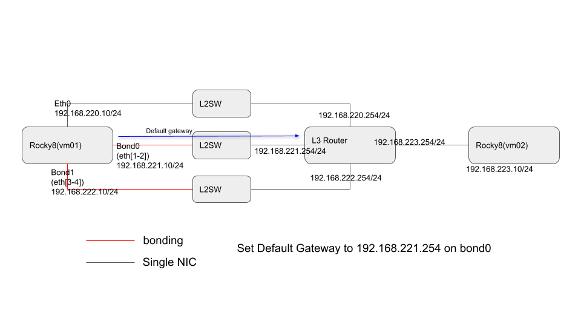

# Configure Policy Based Routing(PBR) on Rocky 8.6

- [Configure Policy Based Routing(PBR) on Rocky 8.6](#configure-policy-based-routingpbr-on-rocky-86)
- [Description](#description)
- [Reference](#reference)
- [Testing environment](#testing-environment)
- [Configuration](#configuration)
- [Confirmation](#confirmation)

# Description

Here is how to configure PBR on RockyLinux8.6.

# Reference

- https://access.redhat.com/documentation/en-us/red_hat_enterprise_linux/8/html/configuring_and_managing_networking/configuring-policy-based-routing-to-define-alternative-routes_configuring-and-managing-networking#doc-wrapper
- https://access.redhat.com/solutions/1257153

# Testing environment



vm01 has three networks
- eth0: 192.168.220.10/24 (configure PBR)
- bond0: 192.168.221.10/24 (default gateway 192.168.221.254)
- bond1: 192.168.222.10/24 (configure PBR)

Configure Policy Based Routing(PBR) to replay a packet from an incomming interface
- If vm01 recieves a packet from eth0, sends a packet to 192.168.220.254 from dev eth0(PBR)
- If vm01 recieves a packet from bond0, sends a packet to 192.168.221.254 from dev bond0(Default gateway)
- If vm01 recieves a packet from bond1, sends a packet to 192.168.222.254 from dev bond1(PBR)

# Configuration

on the vm01
- set IPv4 address on every devices(eth0,bond0,bond1)
- configure default gateway on bond1

```text
[root@vm01 ~]# cat /etc/rocky-release
Rocky Linux release 8.6 (Green Obsidian)
[root@vm01 ~]# rpm -qa NetworkManager
NetworkManager-1.36.0-7.el8_6.x86_64

[root@vm01 ~]# sysctl -a |grep -E '[eth0|bond0|bond1].arp_filter'
net.ipv4.conf.bond0.arp_filter = 0
net.ipv4.conf.bond1.arp_filter = 0
net.ipv4.conf.default.arp_filter = 0
net.ipv4.conf.eth0.arp_filter = 0
net.ipv4.conf.eth1.arp_filter = 0
net.ipv4.conf.lo.arp_filter = 0
[root@vm01 ~]# 
[root@vm01 ~]# sysctl -a |grep -E '[eth0|bond0|bond1].rp_filter'
net.ipv4.conf.bond0.rp_filter = 0
net.ipv4.conf.bond1.rp_filter = 0
net.ipv4.conf.default.rp_filter = 0
net.ipv4.conf.eth0.rp_filter = 0
net.ipv4.conf.eth1.rp_filter = 0
net.ipv4.conf.lo.rp_filter = 0

[root@vm01 ~]# sysctl -a |grep -E '[eth0|bond0|bond1].forwarding'
net.ipv4.conf.bond0.forwarding = 0
net.ipv4.conf.bond1.forwarding = 0
net.ipv4.conf.default.forwarding = 0
net.ipv4.conf.eth0.forwarding = 0
net.ipv4.conf.eth1.forwarding = 0
net.ipv4.conf.lo.forwarding = 0
net.ipv6.conf.bond0.forwarding = 0
net.ipv6.conf.bond1.forwarding = 0
net.ipv6.conf.default.forwarding = 0
net.ipv6.conf.eth0.forwarding = 0
net.ipv6.conf.eth1.forwarding = 0
net.ipv6.conf.lo.forwarding = 0
[root@vm01 ~]# 
```

```text
[root@vm01 ~]# for i in eth0 bond0 bond1 ; do ip -4 a s $i |grep inet ;done
    inet 192.168.220.10/24 brd 192.168.220.255 scope global noprefixroute eth0
    inet 192.168.221.10/24 brd 192.168.221.255 scope global noprefixroute bond0
    inet 192.168.222.10/24 brd 192.168.222.255 scope global noprefixroute bond1

[root@vm01 ~]# ip r s
default via 192.168.221.254 dev bond0 proto static metric 300 
192.168.220.0/24 dev eth0 proto kernel scope link src 192.168.220.10 metric 100 
192.168.221.0/24 dev bond0 proto kernel scope link src 192.168.221.10 metric 300 
192.168.222.0/24 dev bond1 proto kernel scope link src 192.168.222.10 metric 301 

[root@vm01 ~]# nmcli con show bond0 |grep ipv4.gateway
ipv4.gateway:                           192.168.221.254

[root@vm01 ~]# ip r g 1.1
1.1.0.0 via 192.168.221.254 dev bond0 src 192.168.221.10 uid 0 
    cache 
```

configure PBR.
```text
# PBR for eth0
nmcli con mod eth0 +ipv4.routes "0.0.0.0/0 192.168.220.254 table=10"
nmcli con mod eth0 +ipv4.routing-rules "priority 100 iif eth0 table 10"
nmcli con mod eth0 +ipv4.routing-rules "priority 110 from 192.168.220.10 table 10"
nmcli con mod eth0 +ipv4.routing-rules "priority 120 to 192.168.220.0/24 table 10"

# PBR for bond1
nmcli con mod bond1 +ipv4.routes "0.0.0.0/0 192.168.222.254 table=30"
nmcli con mod bond1 +ipv4.routing-rules "priority 200 iif bond1 table 30"
nmcli con mod bond1 +ipv4.routing-rules "priority 210 from 192.168.222.10 table 30"
nmcli con mod bond1 +ipv4.routing-rules "priority 220 to 192.168.222.0/24 table 30"

nmcli device reapply eth0
nmcli device reapply bond0
nmcli device reapply bond1
```

After configuring PBR.
```text
[root@vm01 ~]# nmcli connection show eth0 |grep -E 'ipv4.routing-rules|ipv4.routes|ipv4.gateway'
ipv4.gateway:                           --
ipv4.routes:                            { ip = 0.0.0.0/0, nh = 192.168.220.254 table=10 }
ipv4.routing-rules:                     priority 100 from 0.0.0.0/0 iif eth0 table 10, priority 110 from 192.168.220.10 table 10, priority 120 to 192.168.220.0/24 table 10
[root@vm01 ~]# 
[root@vm01 ~]# nmcli connection show bond0 |grep -E 'ipv4.routing-rules|ipv4.routes|ipv4.gateway'
ipv4.gateway:                           192.168.221.254
ipv4.routes:                            --
ipv4.routing-rules:                     --
[root@vm01 ~]# 
[root@vm01 ~]# nmcli connection show bond1 |grep -E 'ipv4.routing-rules|ipv4.routes|ipv4.gateway'
ipv4.gateway:                           --
ipv4.routes:                            { ip = 0.0.0.0/0, nh = 192.168.222.254 table=30 }
ipv4.routing-rules:                     priority 200 from 0.0.0.0/0 iif bond1 table 30, priority 210 from 192.168.222.10 table 30, priority 220 to 192.168.222.0/24 table 30
[root@vm01 ~]# 
```

```text
[root@vm01 ~]# ip rule list
0:      from all lookup local
100:    from all iif eth0 lookup 10
110:    from 192.168.220.10 lookup 10
120:    from all to 192.168.220.0/24 lookup 10
200:    from all iif bond1 lookup 30
210:    from 192.168.222.10 lookup 30
220:    from all to 192.168.222.0/24 lookup 30
32766:  from all lookup main
32767:  from all lookup default
[root@vm01 ~]# 
[root@vm01 ~]# ip route show table 10
default via 192.168.220.254 dev eth0 proto static metric 100 
192.168.220.254 dev eth0 proto static scope link metric 100 
[root@vm01 ~]# 
[root@vm01 ~]# ip route show table 30
default via 192.168.222.254 dev bond1 proto static metric 301 
192.168.222.254 dev bond1 proto static scope link metric 301 
[root@vm01 ~]# 
[root@vm01 ~]# ip route show table main
default via 192.168.221.254 dev bond0 proto static metric 300 
192.168.220.0/24 dev eth0 proto kernel scope link src 192.168.220.10 metric 100 
192.168.221.0/24 dev bond0 proto kernel scope link src 192.168.221.10 metric 300 
192.168.222.0/24 dev bond1 proto kernel scope link src 192.168.222.10 metric 301 
[root@vm01 ~]# 
```

# Confirmation

send icmp packets to vm01's eth0, bond0, bond1 from vm02(192.168.223.10).

- To vm01 eth0
```text
[root@vm02 ~]# ip -4 a s eth0 |grep inet
    inet 192.168.223.10/24 brd 192.168.223.255 scope global noprefixroute eth0
[root@vm02 ~]# ip r s |head -1
default via 192.168.223.254 dev eth0 proto static metric 100 
[root@vm02 ~]# 
[root@vm02 ~]# ping -c1 192.168.220.10
PING 192.168.220.10 (192.168.220.10) 56(84) bytes of data.
64 bytes from 192.168.220.10: icmp_seq=1 ttl=63 time=0.759 ms

--- 192.168.220.10 ping statistics ---
1 packets transmitted, 1 received, 0% packet loss, time 0ms
rtt min/avg/max/mdev = 0.759/0.759/0.759/0.000 ms
[root@vm02 ~]# 
```

```text
[root@vm01 ~]# tcpdump -nn -i eth0 icmp
dropped privs to tcpdump
tcpdump: verbose output suppressed, use -v or -vv for full protocol decode
listening on eth0, link-type EN10MB (Ethernet), capture size 262144 bytes
02:14:31.652145 IP 192.168.223.10 > 192.168.220.10: ICMP echo request, id 30, seq 1, length 64
02:14:31.652165 IP 192.168.220.10 > 192.168.223.10: ICMP echo reply, id 30, seq 1, length 64
```

- To vm01 bond0
```text
[root@vm02 ~]# ping -c1 192.168.221.10
PING 192.168.221.10 (192.168.221.10) 56(84) bytes of data.
64 bytes from 192.168.221.10: icmp_seq=1 ttl=63 time=0.866 ms

--- 192.168.221.10 ping statistics ---
1 packets transmitted, 1 received, 0% packet loss, time 0ms
rtt min/avg/max/mdev = 0.866/0.866/0.866/0.000 ms
[root@vm02 ~]# 
```

```text
[root@vm01 ~]# tcpdump -nn -i bond0 icmp
dropped privs to tcpdump
tcpdump: verbose output suppressed, use -v or -vv for full protocol decode
listening on bond0, link-type EN10MB (Ethernet), capture size 262144 bytes
02:15:21.611157 IP 192.168.223.10 > 192.168.221.10: ICMP echo request, id 31, seq 1, length 64
02:15:21.611178 IP 192.168.221.10 > 192.168.223.10: ICMP echo reply, id 31, seq 1, length 64
```

- To vm01 bond1
```text
[root@vm02 ~]# ping -c1 192.168.222.10
PING 192.168.222.10 (192.168.222.10) 56(84) bytes of data.
64 bytes from 192.168.222.10: icmp_seq=1 ttl=63 time=0.613 ms

--- 192.168.222.10 ping statistics ---
1 packets transmitted, 1 received, 0% packet loss, time 0ms
rtt min/avg/max/mdev = 0.613/0.613/0.613/0.000 ms
[root@vm02 ~]# 
```

```text
[root@vm01 ~]# tcpdump -nn -i bond1 icmp
dropped privs to tcpdump
tcpdump: verbose output suppressed, use -v or -vv for full protocol decode
listening on bond1, link-type EN10MB (Ethernet), capture size 262144 bytes
02:18:01.352790 IP 192.168.223.10 > 192.168.222.10: ICMP echo request, id 32, seq 1, length 64
02:18:01.352811 IP 192.168.222.10 > 192.168.223.10: ICMP echo reply, id 32, seq 1, length 64
```